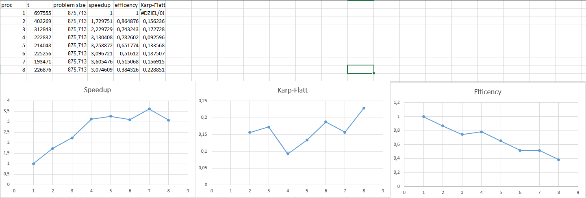

# ConnectedComponents

## Problem

  The problem is to compute connected components on a given graph:

  1) Every vertex has a value

  2) Every vertex sends its value to his neighbours

  3) If a vertex receives a min value which is lower then its value - its value is being replaced

  4) Second step is being repeated until no vertex changed its value

## PCAM metodhology

### Partitioning

  Domain Decomposition will be used in order to solve the problem. Every vertex will be considered as computing unit.
Every Vertex will know its neighbour list and its value.
Every vertex will send its value to its neighbours, then minimum of the vertex value and its neighbours will be computed. This minimum will be assigned as a new value for the vertex. 
Stale value will be computed as a number of vertices that changed their values.

### Communication

  Every vertex will communicate with its vertices

### Agglomeration

  Every vertex and its neighbours will be computed seperately

### Mapping
  
 Decomposition presented in "Partitioning" paragraph will be a consequence of a big computing problem. Because of that spark reduce by function min will be used to compute min value.

## Results

